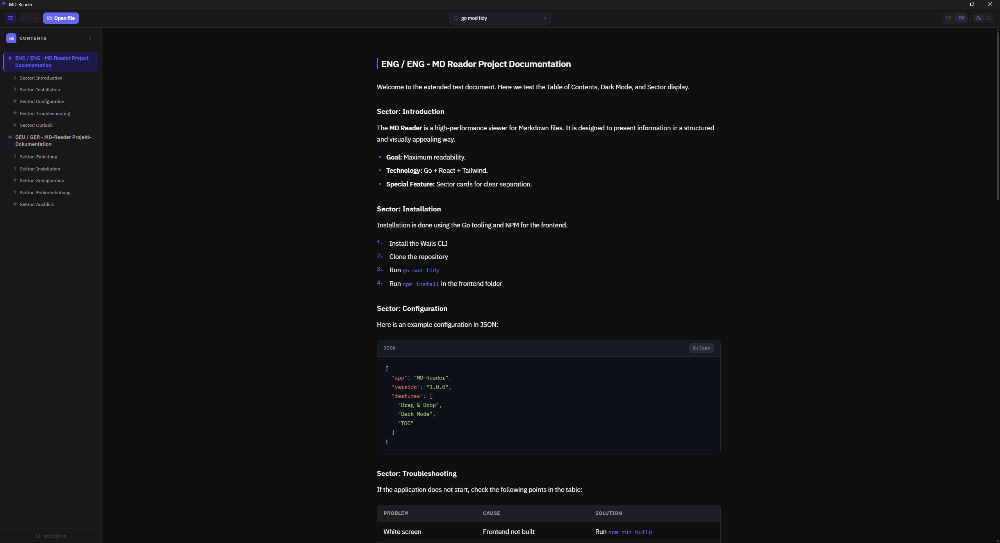

# MD-Reader

> A fast, clean desktop Markdown viewer built with **Go + Wails v2 + React**.  
> Designed for developers and writers who want a distraction-free reading experience for `.md` files.

---

## Table of Contents

- [Features](#features)
- [Screenshots](#screenshots)
- [Requirements](#requirements)
- [Installation & Build](#installation--build)
- [Usage](#usage)
- [Keyboard Shortcuts](#keyboard-shortcuts)
- [Project Structure](#project-structure)
- [Tech Stack](#tech-stack)
- [Contributing](#contributing)

---

## Features

### Core
- **Open files** via file dialog, drag & drop, or double-click from Windows Explorer
- **Tab bar** — open multiple files simultaneously, switch between them with a click or keyboard
- **Recently opened files** — home screen lists your last 8 files for quick access
- **Markdown rendering** with full [GFM](https://github.github.com/gfm/) support (tables, strikethrough, task lists, fenced code, etc.)
- **Syntax highlighting** for code blocks (100+ languages via Prism, One Dark theme)
- **Copy button** on every code block
- **Image lightbox** — click any image to enlarge it with backdrop blur; Esc or click outside to close
- **Auto-reload** — polls the current file every 3 s and reloads automatically when the content changes

### Navigation
- **Table of Contents** — auto-generated sidebar from h2–h4 headings, active section tracked in real time via scroll listener
- **Quick Jump (Ctrl+K)** — fuzzy-search overlay over all document sections; keyboard-navigable with ↑↓ and Enter
- **Relative `.md` links** — clicking a link to another `.md` file opens it directly in a new tab
- **External link protection** — confirmation dialog before opening a URL in the browser
- **Scroll position memory** — switching tabs or reopening files restores the exact scroll position
- **Copy heading anchor** — hover over any heading to reveal a link icon; click to copy `#heading-id` to clipboard
- **Scroll-to-top button** — appears after scrolling 200 px, one click returns to the top

### UI & Layout
- **Focus mode (F11)** — hides header and tab bar, leaving only the content; exit button in the top-right corner
- **Current heading strip** — slim bar between tab bar and content showing the active section title
- **Draggable sidebar** — resize the TOC panel by dragging the edge (160–500 px)
- **Sector blocks** — headings matching `Sector:` / `Sektor:` are rendered as visually distinct section cards (toggleable)
- **Dark theme** — always-on dark interface optimized for long reading sessions
- **Language switcher** — full DE / EN interface localization; setting persists across sessions
- **Search & highlight** — Ctrl+F focuses the search bar; all matches are highlighted inline
- **Settings panel** — 7 tabs: Appearance, Typography, Layout, Reading, Interface, Shortcuts, About

---

## Screenshots



---

## Requirements

| Tool | Version |
| :--- | :--- |
| [Go](https://go.dev/dl/) | 1.21+ |
| [Node.js](https://nodejs.org/) | 18+ |
| [Wails CLI](https://wails.io/docs/gettingstarted/installation) | v2.x |
| Windows | 10 / 11 (primary target) |

> macOS and Linux are supported by Wails but have not been tested with this project.

---

## Installation & Build

### 1. Clone the repository

```bash
git clone https://github.com/Refreryo/md-reader.git
cd md-reader
```

### 2. Install Go dependencies

```bash
go mod tidy
```

### 3. Install frontend dependencies

```bash
cd frontend
npm install
cd ..
```

### 4. Run in development mode

```bash
wails dev
```

This opens the app with hot-reload for the React frontend. Go backend changes require a restart.

### 5. Build a production executable

```bash
wails build
```

The compiled binary will be placed in `build/bin/MD-Reader.exe`.

> **Tip:** To also generate a Windows installer (NSIS), run `wails build --nsis`.

---

## Usage

### Opening a file

| Method | How |
| :--- | :--- |
| File dialog | Click **"Open file"** in the header or press `Ctrl+O` |
| Drag & Drop | Drag any `.md` file onto the app window |
| Explorer | Double-click a `.md` file associated with MD-Reader |
| Example file | Click **"Open example"** on the home screen |

### Tabs

Multiple files can be open at the same time. Each file gets its own tab. Click a tab to switch, click the × to close it. `Ctrl+Tab` and `Ctrl+Shift+Tab` cycle through open tabs.

### Table of Contents

Click the **☰** button to toggle the sidebar TOC. It lists all h2–h4 headings from the current document and highlights the section in view as you scroll. Click any entry to smooth-scroll to that heading. Drag the sidebar edge to resize it.

### Quick Jump

Press `Ctrl+K` to open the Quick Jump overlay. Start typing to filter all sections by name, use ↑↓ to navigate the list, and press Enter to jump. Press Esc to close without navigating.

---

## Keyboard Shortcuts

| Shortcut | Action |
| :--- | :--- |
| `Ctrl+O` | Open file dialog |
| `Ctrl+K` | Open Quick Jump |
| `Ctrl+F` | Focus search bar |
| `Ctrl+,` | Open / close settings |
| `Ctrl+Tab` | Next tab |
| `Ctrl+Shift+Tab` | Previous tab |
| `Ctrl++` | Zoom in |
| `Ctrl+-` | Zoom out |
| `Ctrl+0` | Reset zoom |
| `F11` | Toggle focus mode |
| `Alt+Home` | Go to home screen |
| `Alt+↑` | Scroll to top |
| `Esc` | Close panel / clear search |

---

## Project Structure

```
md-reader/
├── app.go                  # Go backend — file loading, dialog, external links
├── main.go                 # Wails entry point (window size, options)
├── wails.json              # Wails project config
├── go.mod / go.sum         # Go module files
├── example.md              # Sample Markdown file bundled with the app
├── build/
│   └── windows/            # Windows icon and manifest
└── frontend/
    ├── src/
    │   ├── App.tsx                        # Main component — tabs, layout, shortcuts, state
    │   ├── context/
    │   │   └── SettingsContext.tsx         # Global settings state + persistence
    │   ├── components/
    │   │   ├── MarkdownViewer.tsx          # Markdown renderer, syntax highlighting, lightbox
    │   │   ├── TableOfContents.tsx         # Sidebar TOC with scroll tracking
    │   │   └── SettingsPanel.tsx           # 7-tab settings overlay
    │   └── styles/
    │       └── index.css                   # CSS design tokens (dark theme, typography)
    ├── tailwind.config.js
    └── vite.config.ts
```

---

## Tech Stack

| Layer | Technology |
| :--- | :--- |
| Desktop shell | [Wails v2](https://wails.io) |
| Backend | Go 1.21 |
| Frontend | React 18 + TypeScript |
| Styling | Tailwind CSS + CSS custom properties |
| Markdown | [react-markdown](https://github.com/remarkjs/react-markdown) + [remark-gfm](https://github.com/remarkjs/remark-gfm) |
| Syntax highlighting | [react-syntax-highlighter](https://github.com/react-syntax-highlighter/react-syntax-highlighter) (Prism, One Dark theme) |
| Icons | [lucide-react](https://lucide.dev) |
| Fonts | IBM Plex Sans / Mono / Serif (Google Fonts) |
| Build tool | Vite |

---

## Contributing

Contributions, issues and feature requests are welcome.

1. Fork the repository
2. Create a feature branch: `git checkout -b feature/your-feature`
3. Commit your changes: `git commit -m "Add your feature"`
4. Push to the branch: `git push origin feature/your-feature`
5. Open a Pull Request

---

## License

This project is licensed under the MIT License. See [LICENSE](LICENSE) for details.

---

<p align="center">
  Built with ❤️ using Go + Wails + React
</p>
